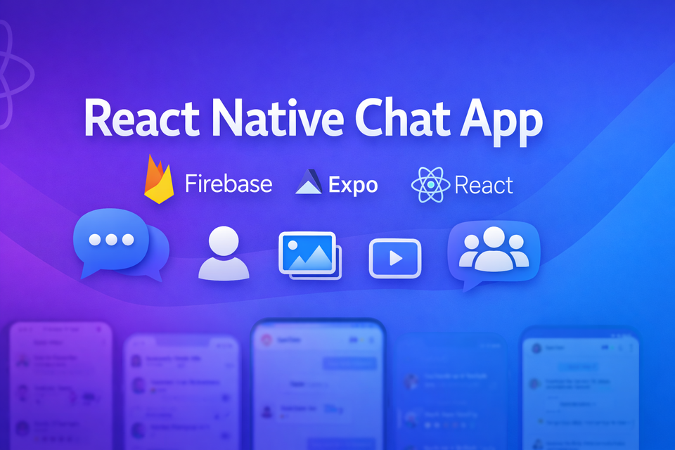
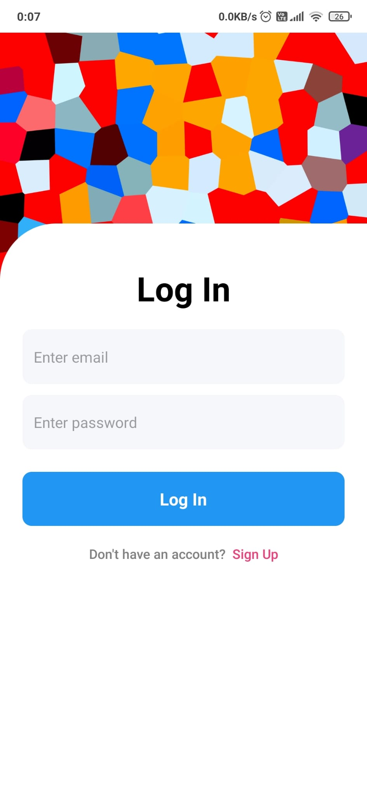
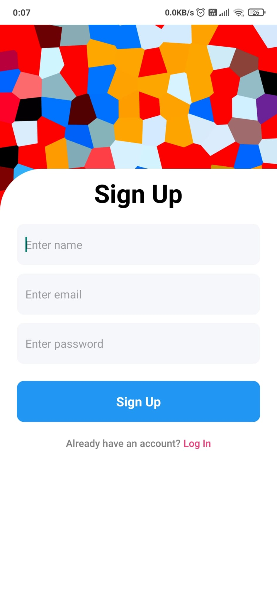
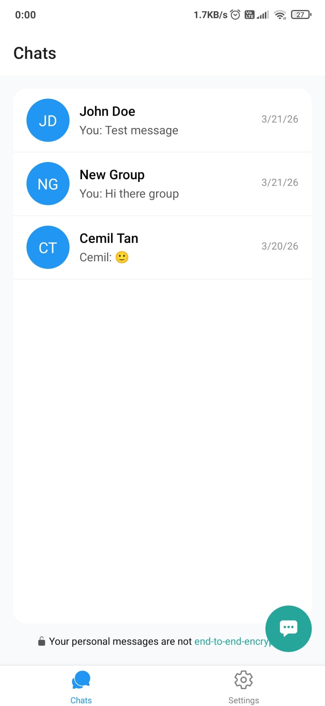
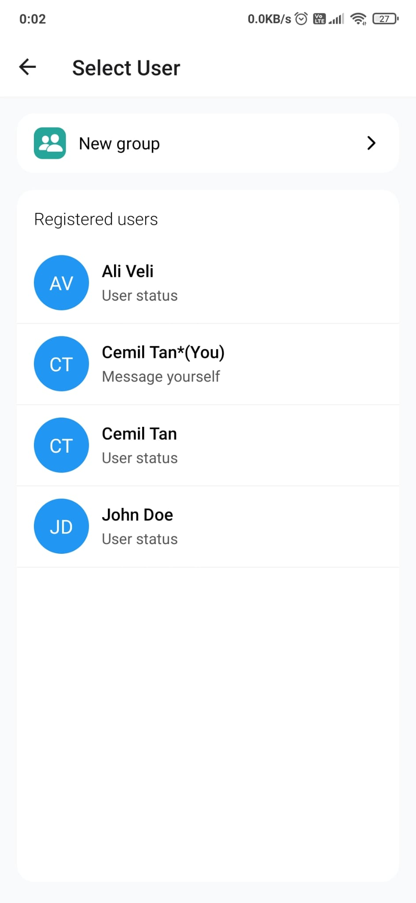
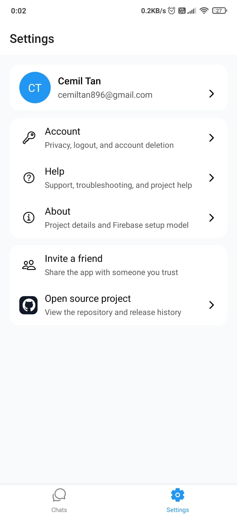
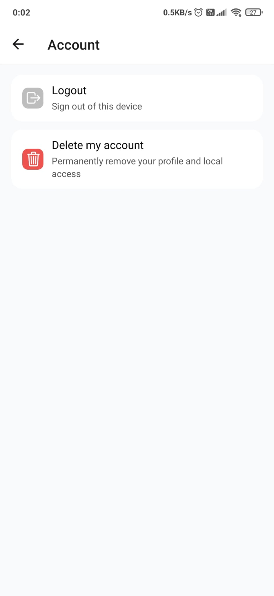
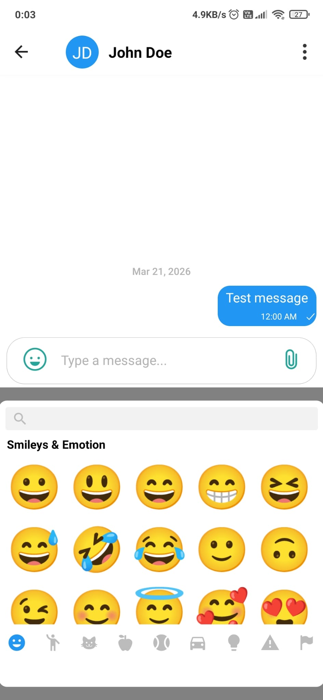
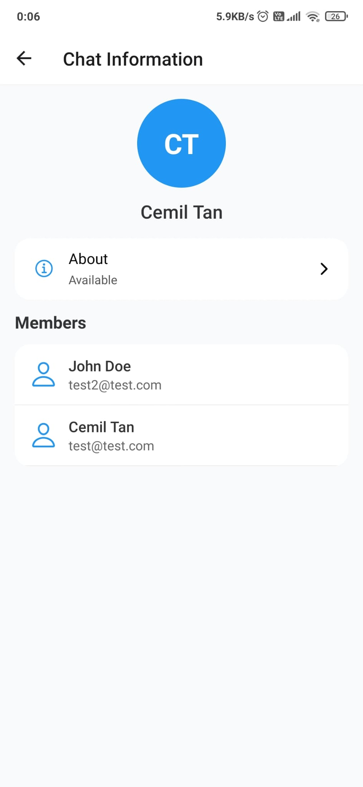

<div align="center">
  
  # React Native Chat App
  
  **A real-time messaging application built with React Native & Firebase**
  
  [](https://reactnative.dev/)
  [](https://firebase.google.com/)
  [](https://expo.dev/)
  
  <br />
  
  [](https://github.com/Ctere1/react-native-chat/stargazers)
  [](https://github.com/Ctere1/react-native-chat/network)
  [](https://github.com/Ctere1/react-native-chat/watchers)
  [](LICENSE)
  
</div>

---


<p align="center">
  <a href="#ℹ️-introduction">Introduction</a> •
  <a href="#-features">Features</a> •
  <a href="#-architecture">Architecture</a> •
  <a href="#-installation-guide">Installation Guide</a> •
  <a href="#-environment-variables">Environment Variables</a> •
  <a href="#-development-scripts">Development Scripts</a> •
  <a href="#-building-guide">Building Guide</a> •
  <a href="#-testing--quality">Testing & Quality</a> •
  <a href="#-screenshots">Screenshots</a> •
  <a href="#-credits">Credits</a> •
  <a href="#-license">License</a> •
  <a href="#-contributors">Contributors</a>
</p>

---

## ℹ️ Introduction



**React Native Chat App** is a real-time chat application built using [React Native](https://reactnative.dev/) and [Expo](https://expo.dev/), powered by [Firebase](https://firebase.google.com/) (Web v9) for authentication and real-time messaging.

> [!NOTE] 
> See screenshots below for a preview.

---

## ⚡ Features

| Feature                 | Description                                                                                           |
| :---------------------- | :---------------------------------------------------------------------------------------------------- |
| **Signup and Login**    | Firebase Email/Password sign-in method. Allow users to sign up using their email address and password |
| **Send Text Message**   | Essential for casual messaging                                                                        |
| **Send Picture**        | You can send pictures without losing quality                                                          |
| **Send Video**          | Capture or pick videos and play them inline inside the chat                                           |
| **Group Chat**          | You can send your messages to multiple people at the same time                                        |
| **Delete Chat**         | Hold and select chats to delete them                                                                  |
| **Delete Account**      | Delete your account from settings                                                                     |
| **Real Time Chat**      | Chats update instantly with new messages                                                              |
| **Local Notifications** | New inbound chat messages can trigger local notifications while the app is running                    |
| **Users List**          | Registered users sorted alphabetically                                                                |
| **Note to Self**        | Create personal notes by messaging yourself                                                           |

---

## 🧱 Architecture

The app uses Expo and Firebase with a screen-first React Native structure:

- `src/App.js` wires the root providers and navigation containers.
- `src/contexts/AuthenticatedUserContext.js` is the single source of truth for Firebase auth state.
- `src/contexts/UnreadMessagesContext.js` manages the unread badge count persisted in AsyncStorage.
- `src/screens/` contains feature screens such as `Chats`, `Chat`, `Users`, `Group`, `Settings`, and account/help flows.
- `src/components/` contains reusable presentation components such as `ContactRow`, `Cell`, `ChatHeader`, and `ChatMenu`.
- `src/components/MessageVideo.js` renders inline video messages for Gifted Chat using `expo-video`.
- `src/services/chatService.js` centralizes chat mutations like direct-chat creation, group-chat creation, and soft delete.
- `src/services/notificationService.js` configures notification permissions/channels and schedules local chat notifications.
- `src/utils/chat.js` centralizes shared chat/user formatting helpers such as initials, display names, previews, and participant shaping.

### Architecture decisions

- Authentication state is subscribed once through context instead of duplicating `onAuthStateChanged` listeners.
- Shared chat/user formatting logic lives in `src/utils/chat.js` to keep screens thin and consistent.
- High-risk Firestore writes are routed through `src/services/chatService.js` so delete/create flows are easier to reason about and test.
- Chat, users, and group selection lists now use `FlatList` for better rendering behavior on large datasets.

---

## 💾 Installation Guide

To clone and run this application, you'll need [Git](https://git-scm.com), [Node.js](https://nodejs.org/en/download/) 20+, and npm.

```bash
# Clone this repository
git clone https://github.com/Ctere1/react-native-chat
cd react-native-chat

# Install dependencies
npm install

# Run quality checks
npm test
npm run lint

# Start the Expo development server
npm start
```

> [!TIP]
> This project now targets **Expo SDK 54**, so use the current [Expo Go](https://expo.dev/go) app or another SDK 54-compatible development client.

> [!WARNING]  
> You must create a `.env` file before the app can connect to Firebase.

---

## 🔐 Environment Variables

Create a `.env` file in the project root and provide the Expo public Firebase values used by `app.config.js`:

```bash
EXPO_PUBLIC_API_KEY=
EXPO_PUBLIC_AUTH_DOMAIN=
EXPO_PUBLIC_PROJECT_ID=
EXPO_PUBLIC_STORAGE_BUCKET=
EXPO_PUBLIC_MESSAGING_SENDER_ID=
EXPO_PUBLIC_APP_ID=
EXPO_PUBLIC_MEASUREMENT_ID=
EXPO_PUBLIC_EAS_PROJECT_ID=
```

These values are read from `app.config.js` and exposed under `expo.extra`.

---

## 🧰 Development Scripts

```bash
npm start        # Start Expo
npm run android  # Native Android dev run (does not create a release APK)
npm run build:android:local         # Build a local Android release APK
npm run build:android:local:clean   # Clean and rebuild the local Android release APK
npm run build:android:eas:preview   # Build an Android APK on EAS using the preview profile
npm run build:android:eas:production # Build the production Android artifact on EAS
npm run ios      # Native iOS run
npm run web      # Expo web
npm test         # Jest unit/component tests
npm run lint     # ESLint
npm run format   # Prettier
```

---

## 🩺 Troubleshooting

- If Expo Go reports a version mismatch, make sure the installed Expo Go app matches **SDK 54**.
- If native dependencies look out of sync after pulling changes, run `npm install` again and restart Metro with `npm start`.
- On Android, `expo-notifications` push functionality is not available in Expo Go. This app now skips unsupported notification setup there and should be tested with a development build for full notification behavior.
- Chat and unread queries are now intentionally sorted client-side so the app does not require a Firestore composite index for `userEmails + lastUpdated` just to run locally.
- Metro may warn about `just-group-by` / `just-map-values` export resolution through `react-native-emoji-modal`. The currently published package version still emits those warnings, so they are non-blocking upstream dependency warnings rather than app-code errors.
- If a `SafeAreaView` deprecation warning still appears, it is coming from the `react-native-popup-menu` dependency rather than the app's own screens.
- For a local Android release APK build, make sure Android NDK `27.1.12297006` is installed. This project's working local release build currently depends on that NDK line together with the repository's Gradle wrapper.

---

## 🏗️ Building Guide

This repository now supports two documented Android release flows:

1. a **local release APK build** from the checked-out native Android project
2. an **EAS Android build** using the profiles in `eas.json`

### Local Android release APK

Use this when you want a release APK directly on your machine.

```bash
npm run build:android:local
```

For a full clean rebuild:

```bash
npm run build:android:local:clean
```

Notes:

- This is the correct local APK flow. `npm run android` is still a native development run command, not a release build command.
- The generated APK is written to:

```text
android/app/build/outputs/apk/release/app-release.apk
```

- The current working local Android release setup expects:
  - Android NDK `27.1.12297006`
  - the repository Gradle wrapper (now aligned to Gradle `8.13`)
  - New Architecture to remain enabled because the current `react-native-reanimated` setup depends on it

### EAS Android builds

Use this when you want Expo/EAS to produce the Android artifact for you.

1. **Set up environment variables**

   Create a `.env` file with your Firebase config. For EAS builds, make sure the same values are configured in your EAS environment as well.

2. **Build the preview Android APK on EAS**

   ```bash
   npm run build:android:eas:preview
   ```

   This uses the `preview` profile in `eas.json`, which is configured to produce an Android APK.

3. **Build the production Android artifact on EAS**

   ```bash
   npm run build:android:eas:production
   ```

   This uses the `production` profile in `eas.json`.

> [!NOTE]
> `.env` values are used by Expo CLI locally, but remote EAS builds should also have the same variables configured in EAS so the bundle step can read the expected Firebase config.

---

## ✅ Testing & Quality

The repository now includes a small automated quality baseline:

- `npm test` runs Jest with the Expo preset.
- `npm run lint` checks the React Native codebase with ESLint.
- `npx expo-doctor` validates Expo package compatibility and native-module expectations.

Current tests cover:

- Shared chat formatting and helper logic in `src/utils/chat.js`
- A basic rendered interaction path for `src/components/ContactRow.js`

Before opening a PR, run:

```bash
npm test
npm run lint
npx expo-doctor
```

---

## 🪟 Screenshots

### **Login & Signup**
|                   Login                   |                  Signup                   |
| :---------------------------------------: | :---------------------------------------: |
|  |  |

### **Chats & Users**
|                   Chats                   |                   Users                   |                Group Chat                 |               Delete Chats                |
| :---------------------------------------: | :---------------------------------------: | :---------------------------------------: | :---------------------------------------: |
|  |  |  |  |

### **Settings & More**
|                 Settings                  |                  Profile                  |                    Help                    |                  Account                   |
| :---------------------------------------: | :---------------------------------------: | :----------------------------------------: | :----------------------------------------: |
|  |  |  |  |

### **Chat Experience**
|                Emoji Panel                 |                Note to Self                |              Main Chat Screen              |                 Chat Info                  |
| :----------------------------------------: | :----------------------------------------: | :----------------------------------------: | :----------------------------------------: |
|  |  |  |  |

###  **Other**
|             Message Indicator              |
| :----------------------------------------: |
|  |

---

## 📝 Credits

This software uses the following packages:

- [Expo](https://expo.dev/)
- [React](https://react.dev/)
- [React Native](https://reactnative.dev/)
- [Firebase](https://firebase.google.com/)
- [react-native-gifted-chat](https://github.com/FaridSafi/react-native-gifted-chat)
- [react-native-emoji-modal](https://github.com/staltz/react-native-emoji-modal)

---

## © License


---

## 📈 Star History

<a href="https://app.repohistory.com/star-history?repo=Ctere1/react-native-chat">
  
</a>

---

## 📌 Contributors


<a href="https://github.com/Ctere1/react-native-chat/graphs/contributors">
  
</a>
