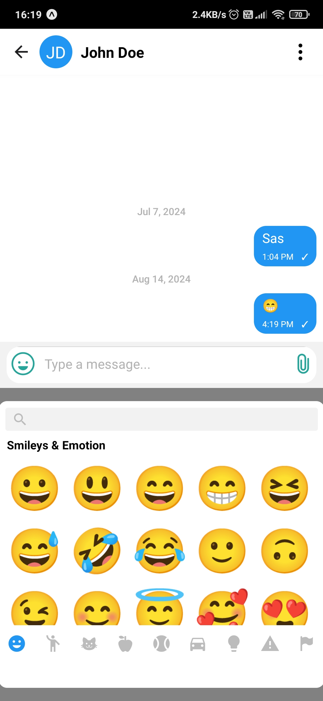
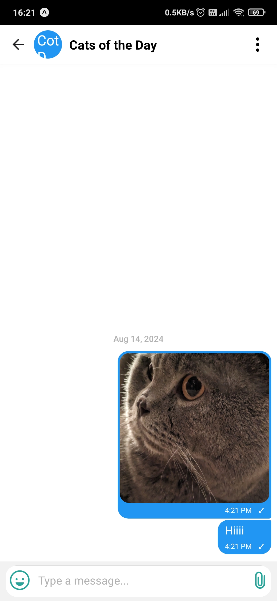

<h1 align="center">
  <br>
   <br>
   React Native Chat App
   <br>
   <br>
   
   
   
</h1>

<div align="center">
  <a href="https://github.com/Ctere1/react-native-chat/stargazers">
    
  </a>
  <a href="https://github.com/Ctere1/react-native-chat/network/members">
    
  </a>
  <a href="https://github.com/Ctere1/react-native-chat/watchers">
    
  </a>
  <br>
</div>

<p align="center">
  <a href="#ℹ️-introduction">Introduction</a> •
  <a href="#features">Features</a> •
  <a href="#installation-guide">Installation Guide</a> •
  <a href="#🏗️building-guide">Building Guide</a> •
  <a href="#screenshots">Screenshots</a> •
  <a href="#credits">Credits</a> •
  <a href="#license">License</a> •
  <a href="#contributors">Contributors</a> 
</p>

---

## ℹ️ Introduction

**React Native Chat App** is a real-time chat application built using [React Native](https://reactnative.dev/) and [Expo](https://expo.dev/), powered by [Firebase](https://firebase.google.com/) (Web v9) for authentication and real-time messaging.

- For the live demo video see [Demo.mp4](./media/ReactNativeChat-Live-Demo.mp4)     

https://github.com/Ctere1/react-native-chat/assets/62745858/bcde4aa0-d2f2-4d8c-8716-bf274c059d2e

> [!NOTE] 
> See screenshots below for a preview.

---

## ⚡ Features

| Feature             | Description                                                                                           |
| :------------------ | :---------------------------------------------------------------------------------------------------- |
| **Signup and Login**  | Firebase Email/Password sign-in method. Allow users to sign up using their email address and password |
| **Send Text Message** | Essential for casual messaging                                                                        |
| **Send Picture**      | You can send pictures without losing quality                                                          |
| **Group Chat**        | You can send your messages to multiple people at the same time                                        |
| **Delete Chat**       | Hold and select chats to delete them                                                                  |
| **Delete Account**    | Delete your account from settings                                                                     |
| **Real Time Chat**    | Chats update instantly with new messages                                                              |
| **Users List**        | Registered users sorted alphabetically                                                                |
| **Note to Self**      | Create personal notes by messaging yourself                                                           |

---

## 💾 Installation Guide

To clone and run this application, you'll need [Git](https://git-scm.com) and [Node.js](https://nodejs.org/en/download/) (with [npm](http://npmjs.com)).

```bash
# Clone this repository
git clone https://github.com/Ctere1/react-native-chat
cd react-native-chat

# Install dependencies
npm install

# Start the Expo development server
npx expo start
```

> [!TIP] 
> Install [Expo Go](https://expo.dev/go) on your mobile device to test the app instantly.

> [!WARNING]  
> Don't forget to set up your `.env` file for Firebase connection. See [Firebase docs](https://firebase.google.com/docs/firestore/quickstart) or [this comment](https://github.com/Ctere1/react-native-chat/issues/1#issuecomment-2414810841).

---

## 🏗️ Building Guide

To build this application for production (e.g., APK for Android):

1. **Set up environment variables:**  
   Create a `.env` file with your Firebase config. Push it to EAS environment:

   ```bash
   eas secret:push --scope project --env-file .env
   ```

2. **Build the APK (Android):**

   ```bash
   eas build -p android --profile preview
   ```

   This will use the preview profile in [eas.json](/eas.json).

> [!NOTE]   
> Environment variables in `.env` are used by Expo CLI locally.  
> For EAS Build, define variables in your `eas.json` build profile for best results.

> **Local Build:**
>
> ```bash
> # For android
> npm run android
>
> # For ios
> npm run ios
> ```

---

## 🪟 Screenshots

### **Login & Signup**
| Login | Signup |
| :---: | :----: |
|  |  |

### **Chats & Users**
| Chats | Users | Group Chat | Delete Chats |
| :---: | :---: | :--------: | :----------: |
|  |  |  |  |

### **Settings & More**
| Settings | Profile | Help | Account |
| :------: | :-----: | :--: | :-----: |
|  |  |  |  |

### **Chat Experience**
| Emoji Panel | Note to Self | Main Chat Screen | Chat Info |
| :---------: | :----------: | :--------------: | :-------: |
|  |  |  |  |

###  **Other**
| Message Indicator |
| :--------------: |
|  |

---

## 📝 Credits

This software uses the following packages:

- [Expo](https://expo.dev/)
- [React](https://react.dev/)
- [React Native](https://reactnative.dev/)
- [Firebase](https://firebase.google.com/)
- [react-native-gifted-chat](https://github.com/FaridSafi/react-native-gifted-chat)
- [react-native-emoji-modal](https://github.com/staltz/react-native-emoji-modal)

---

## © License


---

## 📈 Star History

<a href="https://app.repohistory.com/star-history?repo=Ctere1/react-native-chat">
  
</a>

---

## 📌 Contributors


<a href="https://github.com/Ctere1/react-native-chat/graphs/contributors">
  
</a>