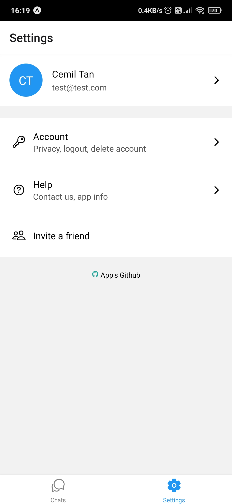
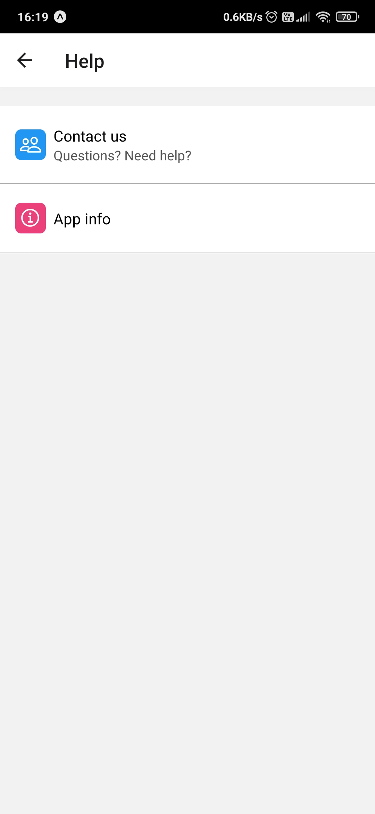
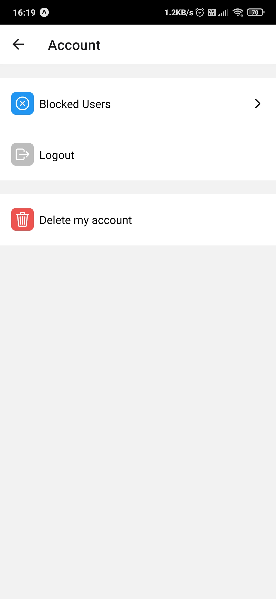

<h1 align="center">
  <br>
   <a ></a><br>
   React Native Chat App
   
   
   
   
</h1>

<p align="center">
  <a href="#ℹ%EF%B8%8F-introduction">Introduction</a> •
  <a href="#features">Features</a> •
  <a href="#installation-guide">Installation Guide</a> •
  <a href="#%EF%B8%8Fbuilding-guide">Building Guide</a> •
  <a href="#screenshots">Screenshots</a> •
  <a href="#credits">Credits</a> •
  <a href="#license">License</a> •
  <a href="#contributors">Contributors</a> 
</p>

<div align="center">


</div>

## ℹ️ Introduction

Real Time Chat Application that written in [React Native](https://reactnative.dev/) and [Expo](https://expo.dev/) platform.
It uses [Firebase](https://firebase.google.com/) (Web version 9) realtime database.  

- For the live demo video see [Demo.mp4](./media/ReactNativeChat-Live-Demo.mp4)     

https://github.com/Ctere1/react-native-chat/assets/62745858/bcde4aa0-d2f2-4d8c-8716-bf274c059d2e

>[!Note] 
  You can check the screenshots below

 
## ⚡Features
 
| Feature             | Description                                                                                           |
| :------------------ | :---------------------------------------------------------------------------------------------------- |
| `Signup and Login`  | Firebase Email/Password sign-in method. Allow users to sign up using their email address and password |
| `Send Text Message` | Essential for casual messaging                                                                        |
| `Send Picture`      | You can send pictures without losing quality                                                          |
| `Group Chat`        | You can send your messages to multiple people at the same time                                        |
| `Delete Chat`       | You can delete chats after holding and selecting them                                                 |
| `Delete Account`    | You can delete your account                                                                           |
| `Real Time Chat`    | The last incoming message will be placed at the top of the chat screen                                |
| `Users List`        | Registered users sorted by alphabetical index (A -> Z)                                                |
| `Note to Self`      | You can also take notes by sending a message to yourself                                              |

## 💾Installation Guide
 
 To clone and run this application, you'll need [Git](https://git-scm.com) and [Node.js](https://nodejs.org/en/download/) (which comes with [npm](http://npmjs.com))    installed on your computer. 
 
 ```bash
 # Clone this repository
 $ git clone https://github.com/Ctere1/react-native-chat
 # Go into the repository
 $ cd react-native-chat
 # Install dependencies
 $ npm install
 ```

 > For running the app:
 ```bash
 # Go into the repository
 $ cd react-native-chat
 # Run the expo
 $ npx expo start
 ```
 
 After these steps install the [Expo Go](https://expo.dev/go) mobile app from the Google Play Store or Apple App Store on your testing device. This app allows you to run and test React Native applications built with Expo.
 
 > [!Warning]  
   Do not forget to setup `.env` file for Firebase connection. Please see the [doc](https://firebase.google.com/docs/firestore/quickstart) or see this [comment](https://github.com/Ctere1/react-native-chat/issues/1#issuecomment-2414810841)


## 🏗️Building Guide
 
To build this application, follow these steps:

- Before you can build the application, you need to configure your environment variables. Ensure you have a `.env` file with the necessary Firebase configuration. Push the `.env` file to the EAS environment using the following command:

  ```bash
  eas secret:push --scope project --env-file .env
  ```

- With the environment variables set and dependencies installed, you can build the APK for Android. Use the following command:

  ```bash
  eas build -p android --profile preview
  ```

This command will start the build process using the preview profile (see [eas.json](/eas.json)). The build process will package your application into an APK file that you can install on an Android device.

>[!Note]  
  Environment variables defined in a `.env` file are only considered by the Expo CLI. Therefore, if you upload a `.env` file to EAS Build, it can be used to inline `EXPO_PUBLIC_` variables into your application code.However, the recommended practice is to use `.env` files in your local environment, while defining environment variables for EAS Build in `eas.json`. Environment variables defined in your `eas.json` build profile will be used when evaluating your `app.config.js` when running eas build and will be available to all steps of the build process on the EAS Build server. This may result in some duplication of variables between `.env` files and eas.json build profiles, but makes it easier to see what variables will be applied across all environments.

> [!Note]   
> You can also build the application locally. To do this, run the following command:

  ```bash
  # For android
  npm run android

  # For ios
  npm run ios
  ```

## 🪟Screenshots

### **Login-Signup Pages**
|                   Login                   |                  Signup                   |
| :---------------------------------------: | :---------------------------------------: |
|  |  |


### **Chats Page**
|                   Chats                   |                   Users                   |                Group chat                 |               Delete chats                |
| :---------------------------------------: | :---------------------------------------: | :---------------------------------------: | :---------------------------------------: |
|  |  |  |  |


### **Settings Page**
|                 Settings                  |                  Profile                  |                    Help                    |                  Account                   |
| :---------------------------------------: | :---------------------------------------: | :----------------------------------------: | :----------------------------------------: |
|  |  |  |  |


### **Chat Page**
|                Emoji Panel                 |                Note to Self                |              Main Chat Screen              |          Chat Information Screen           |
| :----------------------------------------: | :----------------------------------------: | :----------------------------------------: | :----------------------------------------: |
|  |  |  |  |


###  **Others**
|             Message Indicator              |
| :----------------------------------------: |
|  |

## 📝Credits

This software uses the following packages:

- [Expo](https://expo.dev/)
- [React](https://react.dev/)
- [React Native](https://reactnative.dev/)
- [Firebase](https://firebase.google.com/)
- [react-native-gifted-chat](https://github.com/FaridSafi/react-native-gifted-chat)
- [react-native-emoji-modal](https://github.com/staltz/react-native-emoji-modal)


## ©License


[LICENSE](./LICENSE)


## 📌Contributors


<a href="https://github.com/Ctere1/react-native-chat/graphs/contributors">
  
</a>
